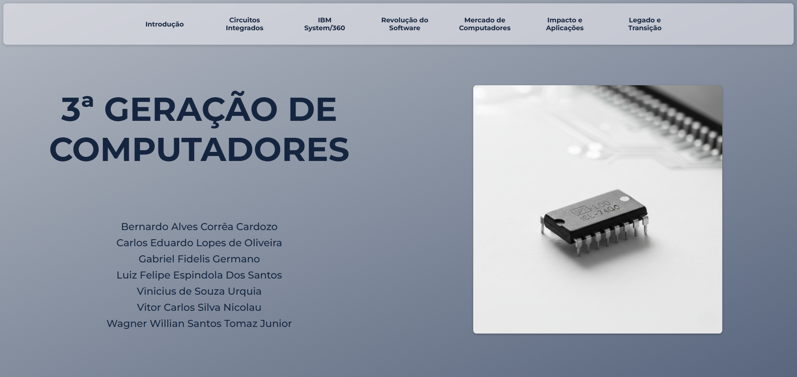

# Terceira Geração de Computadores

Projeto de site criado para o trabalho da disciplina de **Arquitetura e Organização de Computadores** no curso de **Análise e Desenvolvimento de Sistemas** da **FATEC Guaratinguetá**.  

O objetivo do seminário era apresentar o tema **3ª Geração de Computadores**.  
Desenvolvemos um **site interativo** para expor o conteúdo.

<a href="https://wagnertomaz.github.io/terceira-geracao-computadores" target="_blank">🔗 Acesse o site</a><br><br>


---

## Sobre o Trabalho

- **Disciplina:** Arquitetura e Organização de Computadores  
- **Tema:** Terceira Geração de Computadores (1964–1971)  
- **Instituição:** FATEC Guaratinguetá  
- **Curso:** Análise e Desenvolvimento de Sistemas 

O site apresenta:
- Contexto histórico e transição tecnológica  
- Principais avanços da época (uso de circuitos integrados, família de mainframes compatíveis)  
- Exemplos de computadores representativos  
- Impactos no mercado e na sociedade  

---

## Tecnologias Utilizadas

- **HTML5**  
- **CSS3**  
- **JavaScript**  
  - Usado apenas para tornar o **menu lateral mais interativo**, com:  
    - Hover (abrir/fechar automaticamente)  
    - Clique (marcar o item ativo)  
    - Scroll (destacar o tópico atual na tela)   

---

## Estrutura do Projeto

```bash
.
├── index.html        # Página inicial
├── /pages            # Conteúdos divididos por páginas
├── /css              # Estilos do site
├── /images          # Imagens utilizadas
├── /video            # Vídeos utilizados
└── /js               # Scripts (menu interativo)
